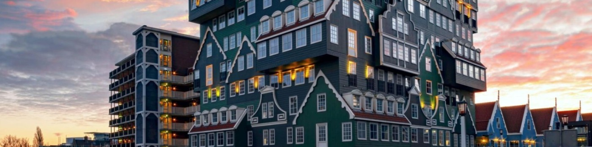

## Hello world 👋 I'm Johan

I'm a South African 🇿🇦 living in the Netherlands 🇳🇱 — a Software Engineer by day, gamer for life 🎮💻🌍

#### About me
- 💼 Senior Software Engineer at [Capgemini](https://www.capgemini.com/nl-nl/)
- 🧠 Passionate full-stack developer with a strong Java + Spring and Business IT background 
- 🚀 Skilled in TypeScript, Node.js, Angular, Express, MongoDB, SQL, Kubernetes, Jenkins, GitLab, GitHub, ELK Stack, AWS & Azure
- 🤝 Communicative and client-focused — I translate needs into elegant technical solutions
- 🎮 Forever gamer — especially into tabletop and online trading card games, but always up for anything. Got a favourite? Let’s play together!
- TODO

#### Skills
 
 

#### TODO — Connect with me

#### TODO — Projects & Stats
| Project 📽️ | Issues 🐛 | Open PRs 🔔 | Closed PRs 🔥 |
|---------------------------------------------------------------------------------------------------|-----------|-------------|---------------|
| [**DevJourney**](https://github.com/Druaka/devjourney)                      | x         | x           | x             |

|  |  |
|------------------------------------------------------------------------------------------------------------------------------------------------------------------------------------------------------------------------------------------------| ------------- |

<i>“The beautiful thing about learning is that nobody can take it away from you.”</i> — B.B. King

